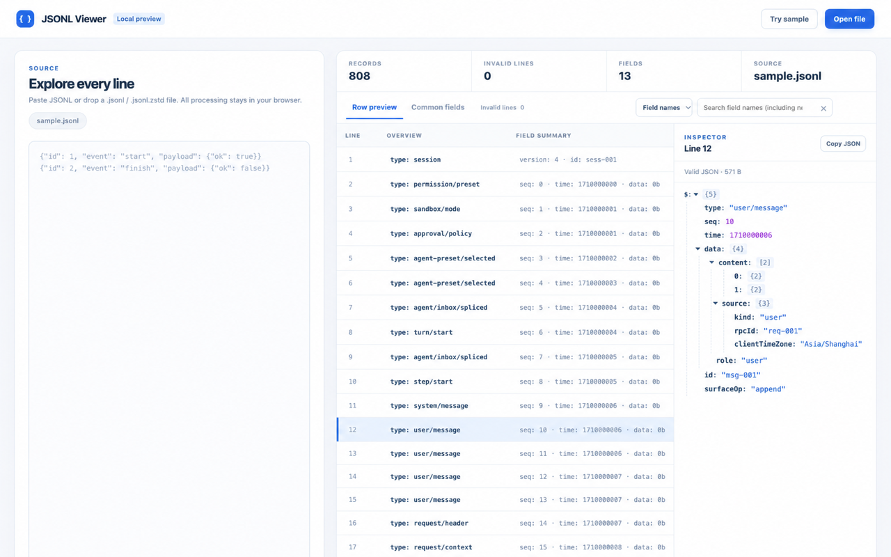

# JSONL Viewer

一个无需构建步骤的开源 Chrome Manifest V3 扩展。点击工具栏图标打开独立预览页，支持粘贴 JSONL，或选择、拖入 `.jsonl`、`.ndjson`、`.jsonl.zstd`、`.jsonl.zst` 文件。文件始终留在浏览器本地。

扩展会根据 Chrome 的界面语言自动切换文案，目前支持英语、简体中文、繁体中文、日语、韩语、西班牙语、法语、德语和巴西葡萄牙语；其他语言回退到英语。扩展名称统一显示为 **JSONL Viewer**。

## 界面预览

演示图基于扩展界面，记录内容已替换为示例数据。

## 特性

- **本地打开压缩文件**：直接选择或拖入 JSONL、NDJSON 和 zstd 压缩的 JSONL；无需先手动解压，也不会上传文件。
- **适配不同结构的记录**：「逐行预览」展示每行自己的内容，不要求所有行具有相同字段，也不依赖 `type` 等特定字段。
- **快速定位内容**：按嵌套字段名、字段值或原始行搜索；「公共字段表」方便比较常见字段。
- **查看完整结构**：点击记录展开 JSON 树、复制 JSON 或字段路径；长字符串可在阅读视图中完整查看。
- **隔离异常行**：无效 JSON 和超长行单独列出，保留行号及原始片段，方便回到源文件定位。

## 安装与使用

**Chrome Web Store：**1.0.0 版本已提交审核，当前尚未上架。审核通过后，在 [Chrome Web Store](https://chromewebstore.google.com/) 搜索 **JSONL Viewer**，核对上方蓝色图标与商店页面中的[项目主页](https://github.com/YaoKaiLun/jsonl-preview)后安装。商店中可能出现同名扩展，请勿仅凭名称辨认。

审核期间可先手动安装：

1. [下载扩展 ZIP](dist/jsonl-preview-v1.0.0.zip)，解压到一个固定的文件夹。确认该文件夹**根目录**能看到 `manifest.json`；不要在 Chrome 中选择 ZIP 文件本身。
2. 在 Chrome 地址栏打开 `chrome://extensions`，开启右上角的「开发者模式」，点击「加载已解压的扩展程序」，选择刚才解压出的文件夹。安装后可在扩展菜单中将图标固定到工具栏。
3. 点击扩展图标打开预览页。粘贴 JSONL 后按 `⌘/Ctrl + Enter`，或选择、拖入文件；点击记录即可查看右侧 JSON 树。更新手动安装的版本时，下载并解压新版文件，然后在 `chrome://extensions` 点击该扩展的「重新加载」。

开发者也可以克隆本仓库，在第 2 步直接选择包含 `manifest.json` 的项目目录。扩展的搜索可选择字段名（包含嵌套键）、字段值或原始行；异常行始终按原文搜索。长字符串可点「阅读全文」，按原始换行查看和复制。

也可以直接用 `file://` 打开 `viewer.html` 试用：此时解析器在页面中分批运行，较大的文件可能短暂影响交互。通过扩展图标打开时仍使用独立 Worker。扩展本身不需要服务器、权限或联网。`vendor/fzstd.js` 是随扩展打包的 [fzstd 0.1.1](https://github.com/101arrowz/fzstd)，MIT 许可证见 `vendor/fzstd.LICENSE`。

## 设计与边界

- 扩展页面在 Web Worker 中分块读取；直接打开 HTML 时复用同一解析器并在页面中运行。zstd 通过流式解压器处理；UTF-8 解码可以跨块；每行单独 `JSON.parse`，坏行保留原始片段和行号。
- 表格只绘制当前视口附近的行。Worker 保存原始行，点击/滚动时才把可见行转成表格值，树节点按需展开。搜索在 Worker 中执行。
- 当前上限是 **256 MiB 解码后数据、100 万条有效记录、单行 400 万字符**。超长行会进入「异常行」，后续行继续解析。这些是内存保护阈值，不等于已经对接近阈值的文件做过性能承诺。粘贴内容本身仍需浏览器持有一份文本，搜索目前会线性扫描所有行。
- 「逐行预览」按每条记录自己的字段生成摘要，不依赖统一 schema；有 `type`、`event`、`kind` 或 `role` 时仅用它作概览标签，没有这些字段也能正常显示。「公共字段表」从前 1000 条有效记录中按出现频率选最多 6 个字段，完整记录可在树中查看。JSONL 每行可以是任意合法 JSON 值；空行忽略。
- `fzstd` 对压缩时使用超大回溯窗口的 zstd 文件有[已知限制](https://github.com/101arrowz/fzstd#considerations)。如果要稳定处理数 GB 文件、极高压缩级别、随机跳转和复杂筛选，需要磁盘索引或更完整的 WASM zstd 实现。
- 目前只处理用户主动选择的本地文件与粘贴内容；没有自动接管网页上的 JSONL 响应。

## 验证

运行 `npm ci && npm test`。测试覆盖跨块 UTF-8、CRLF、空行、错误行、超长行恢复、搜索、zstd 流式解压，以及直接打开 HTML 时的解析器路径。扩展页面的示例记录、树展开与真实 `.jsonl.zstd` 文件此前已在浏览器中验证；直接打开 HTML 的新路径尚未做浏览器界面验收。

## 发布

仓库中已提交可安装的 [v1.0.0 ZIP](dist/jsonl-preview-v1.0.0.zip)。运行 `npm run package:extension` 可重新生成 ZIP；`npm run check:package` 会核对仓库中的 ZIP 与当前扩展源码是否一致。ZIP 只包含运行所需文件；不要把整个 Git 仓库或 `node_modules` 上传到 Chrome Web Store。Chrome Manifest 的本地化文件可用 `python3 scripts/generate-manifest-locales.py` 重新生成。图标和商店宣传图的源脚本为 `scripts/generate-assets.py`（重新生成需要 Pillow）。

1.0.0 版本已提交 Chrome Web Store 审核；审核结果与实际上架时间以商店后台为准。README 中的演示图为 1280×800，数据已替换为示例；商店提交应使用从真实安装的扩展拍摄且已脱敏的截图。开发者账户注册、上传 ZIP、填写商店资料与隐私实践、选择发布范围、提交审核的步骤见 [Chrome Web Store 提交指南](STORE_LISTING.md)。

## 开源

项目使用 [MIT License](LICENSE)；打包的 `fzstd` 保留其 [MIT 许可证](vendor/fzstd.LICENSE)。隐私说明有[中文版](PRIVACY.md)和[英文版](PRIVACY_EN.md)；英文商店填写稿见 [STORE_LISTING_EN.md](STORE_LISTING_EN.md)。欢迎通过 [Issues](https://github.com/YaoKaiLun/jsonl-preview/issues) 报告可复现的问题，贡献方式见 [CONTRIBUTING.md](CONTRIBUTING.md)。请勿上传包含真实个人信息或密钥的 JSONL 样本。
